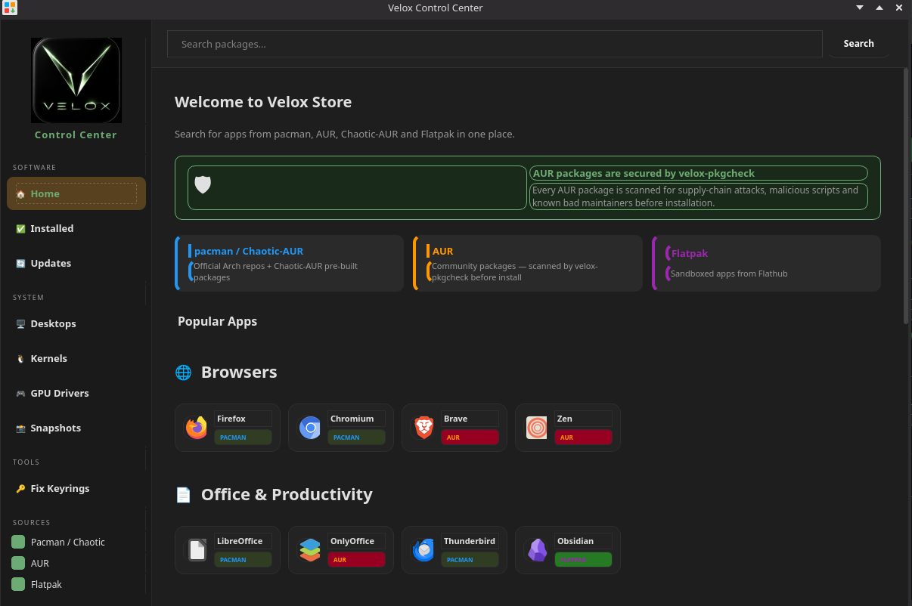

# Package Management

Velox gives you access to the full Arch package ecosystem: the official repos, Chaotic-AUR, the AUR via `paru`, and Flatpak — all in one place through the Velox Control Center.

## Velox Control Center

The easiest way to install software. Search across all sources simultaneously and install with one click — no terminal needed.



- **pacman / Chaotic-AUR** — official Arch repos and pre-built AUR packages
- **AUR** — community packages, scanned by `velox-pkgcheck` for supply-chain attacks before installation
- **Flatpak** — sandboxed apps from Flathub

Open it from the taskbar or run `velox-control-center`.

## Package sources

| Source | What's in it | How to use |
|---|---|---|
| **Official repos** (core, extra, multilib) | Arch Linux packages | `sudo pacman -S <pkg>` or Control Center |
| **Chaotic-AUR** | Pre-built AUR packages | `sudo pacman -S <pkg>` or Control Center |
| **velox_repo** | Velox packages (kernel, control center, wallpapers) | automatic |
| **AUR** | Community source packages | `paru -S <pkg>` or Control Center |
| **Flatpak** | Sandboxed apps | `flatpak install <app>` or Control Center |

## pacman — quick reference

```bash
sudo pacman -Syu              # full system upgrade
sudo pacman -S <package>      # install a package
sudo pacman -Rs <package>     # remove package + unused deps
sudo pacman -Ss <keyword>     # search repos
sudo pacman -Qi <package>     # info on installed package
sudo pacman -Ql <package>     # list files owned by package
```

## paru — AUR helper

```bash
paru -S <package>             # install from AUR (or repos)
paru -Syu                     # upgrade everything including AUR
paru -Ss <keyword>            # search AUR + repos
paru -c                       # clean unneeded dependencies
```

## Flatpak

```bash
flatpak install flathub <app.id>    # install from Flathub
flatpak update                       # update all Flatpaks
flatpak list                         # list installed
flatpak uninstall <app.id>          # remove
```

## AUR Security

Every AUR package installed through the Control Center is scanned by `velox-pkgcheck` before installation. It checks for supply-chain attacks, malicious scripts, and known bad maintainers. You'll see a severity rating and can cancel or proceed.

### Why this exists

The AUR is unmoderated — anyone can publish a package. In **July 2025** three AUR packages were found to be actively malicious: `librewolf-fix-bin`, `firefox-patch-bin`, and `zen-browser-patched-bin`. All three ran cryptocurrency miners and exfiltrated user credentials while appearing to be legitimate browser builds. AUR helpers like `paru` and `yay` have no built-in scanning — they download and run whatever PKGBUILD is published.

`velox-pkgcheck` reviews the PKGBUILD before anything is downloaded or built, flagging suspicious patterns so you can make an informed choice.

## Partial Update Protection

Partial upgrades are one of the most common ways Arch Linux systems break. They happen when you install a new package without first syncing the package database — the new package may depend on a library version that hasn't been installed yet, silently breaking other software.

**Velox prevents this automatically.** Every time you install a pacman package through the Control Center, it checks how long ago the package database was last synced. If it's been more than 1 hour, you'll see a warning:

> **"Your package database hasn't been synced in X hours. Installing without updating first can cause dependency conflicts."**

You'll have three options:

| Option | What it does |
|---|---|
| **Update System & Install** | Runs `pacman -Syu` first, then installs — the safe choice |
| **Install Anyway** | Skips the update and installs directly — use only if you know what you're doing |
| **Cancel** | Does nothing |

Once you've done a full update the database is fresh, so subsequent installs in the same session go through without the dialog.

### Why this exists

The [ArchWiki System Maintenance page](https://wiki.archlinux.org/title/System_maintenance) explicitly states: *"Partial upgrades are unsupported on Arch Linux."* Arch uses rolling, ABI-breaking library updates — installing a package that was built against a newer library than what's on your system can silently corrupt other software or cause immediate crashes.

This exact failure mode is discussed year after year on the Arch Linux Forums ([thread 1](https://bbs.archlinux.org/viewtopic.php?id=298177), [thread 2](https://bbs.archlinux.org/viewtopic.php?id=306427)) and is cited in [XDA Developers](https://www.xda-developers.com/reasons-never-used-arch-linux-daily-driver/) as one of the main reasons Arch breaks for everyday users. Despite being officially unsupported, nothing in the default pacman tooling prevents it — Velox closes that gap.
