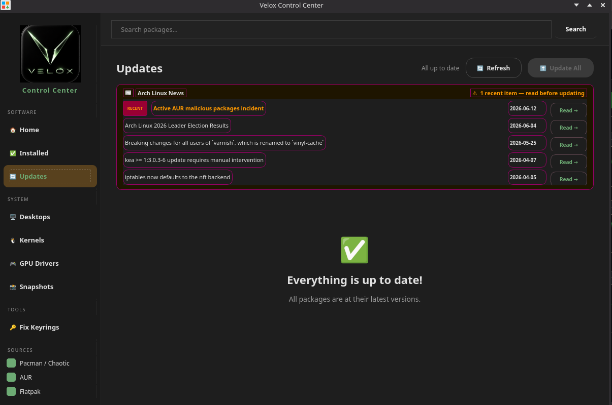

# System Updates

Velox is a rolling release — you get the latest packages continuously, with no version upgrades needed.

## One-click update via Control Center

Open the Control Center → click **Updates** in the sidebar.



The updates page does two things before running:

1. **Checks for available package updates** — lists everything with old and new version numbers
2. **Fetches the Arch Linux news feed** — shows the last 5 news items live from archlinux.org. Items from the last 14 days are flagged **RECENT** in orange. Some updates require a manual step first — this makes sure you never miss one.

### Why this exists

The [ArchWiki System Maintenance page](https://wiki.archlinux.org/title/System_maintenance) explicitly states: *"Before upgrading, users are expected to visit the Arch Linux home page to check the latest news."* Arch is a rolling release, and occasionally an update requires a manual intervention step before running `pacman -Syu` — migrating a config file, running a one-off command, or handling a renamed package. The news feed at [archlinux.org/news](https://archlinux.org/news/) is where these are announced.

In practice almost no one checks it, which is why "Arch broke after an update" is a perennial topic on the [Arch Linux Forums](https://bbs.archlinux.org/viewtopic.php?id=298177). The Velox Control Center fetches the live feed and surfaces it directly in the update flow so required steps are never missed.

Click **Update All** to run `pacman -Syu` + `flatpak update` together. If there are recent news items, you'll see a warning dialog listing them before the update proceeds.

## Terminal update

```bash
sudo pacman -Syu
```

This updates packages from all configured repos (official, Chaotic-AUR, velox_repo) in one command.

## Including AUR packages

```bash
paru -Syu
```

`paru` updates both official and AUR packages.

## Updating Flatpaks

```bash
flatpak update
```

## Kernel updates

The `linux-velox` kernel updates like any other package via `paru -Syu`. After a kernel update, **reboot** to load the new kernel. DKMS modules (like NVIDIA) rebuild automatically during the update.

To check the running kernel:

```bash
uname -r
```

## Update frequency

Arch Linux / Velox packages move fast. It's good practice to update at least once a week. Avoid skipping updates for months — very large gaps can occasionally cause dependency conflicts.

## Before a major update

Take a snapshot first:

```bash
sudo snapper -c root create --description "before update $(date +%Y-%m-%d)"
sudo pacman -Syu
```

Or use Control Center → **Snapshots** to create one with a button click.

## Mirrors

Velox uses the standard Arch mirrorlist. To refresh mirrors for the fastest servers:

```bash
sudo reflector --country "United States" --latest 10 --sort rate --save /etc/pacman.d/mirrorlist
```
